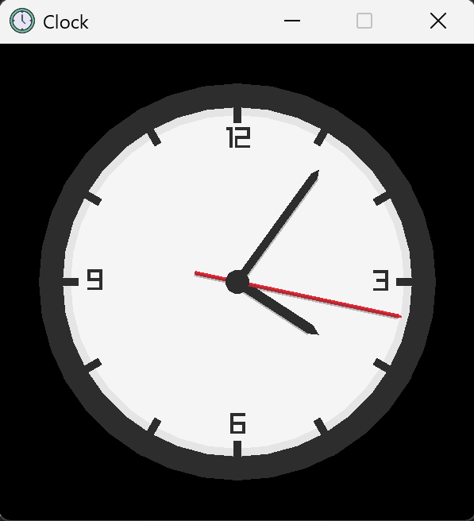

# Easy Clock

### Overview

An easy clock program developed in C++ using Visual Studio 2022  
<strong>External library used</strong>: [Raylib](https://www.raylib.com/)

### Features

- <strong>Real-time clock synchronization using system time</strong>
- <strong>Dark background with white clock face for maximum legibility and contrast</strong>
- <strong>Built with OOP principles, providing a clean and modular structure for parameter tuning</strong>

### Screenshots  
 

  
   
  <em><strong>Clock</strong></em>

#### Give it a try now! 👉: [Download](https://github.com/LCZ-ctrl/Easy_Clock/releases)
  
