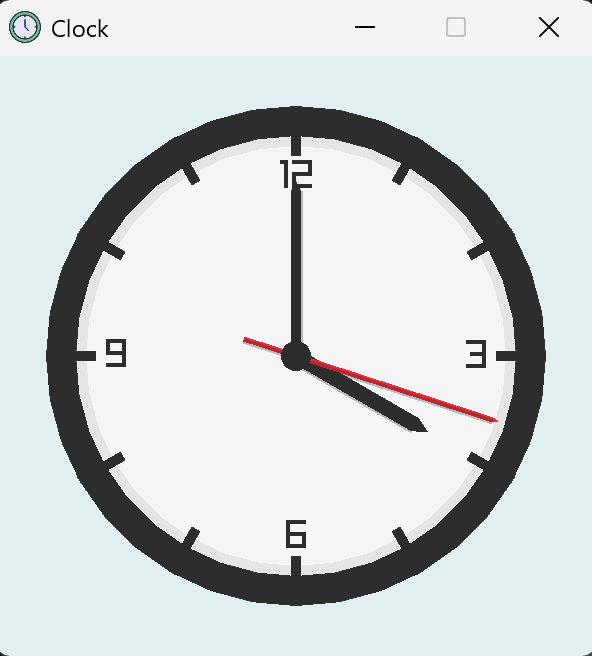
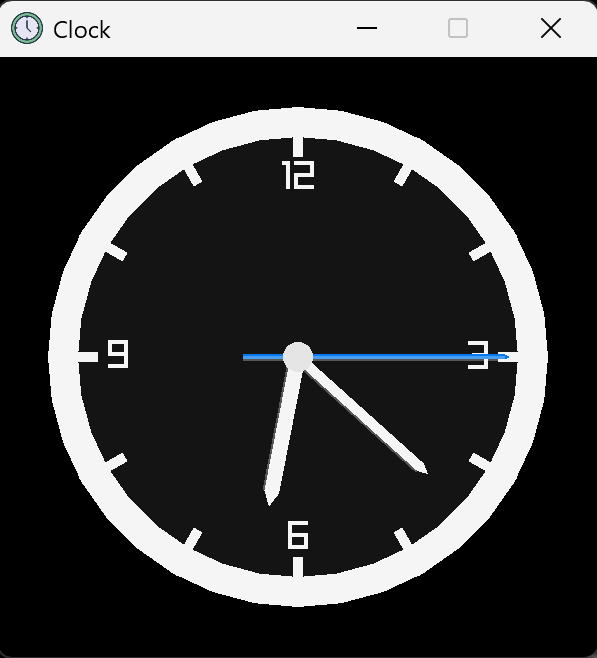

# Easy Clock

[简体中文](README_zh.md) | English
> 逝者如斯夫，不舍昼夜。

### Overview

An easy clock program developed in C++ using Visual Studio 2022  
<strong>External library used</strong>: [Raylib](https://www.raylib.com/)

### Features

- <strong>Real-time clock synchronization using system time</strong>
- <strong>Dark background with white clock face for maximum legibility and contrast</strong>
- <strong>Built with OOP principles, providing a clean and modular structure for parameter tuning</strong>

### Screenshots  
 

  
   
  <em><strong>Clock</strong></em>

#### Give it a try now👉: [Download](https://github.com/LCZ-ctrl/Easy_Clock/releases)
  
### Attention
In the latest version, the light and dark dials are not provided separately  
However, they remain accessible in the v1.0.0 release package
  
<table align="center">
  <tr>
    <td align="center">
       
      <em><strong>Light dial</strong></em>
    </td>
    <td align="center">
       
      <em><strong>Dark dial</strong></em>
    </td>
  </tr>
</table>
  
